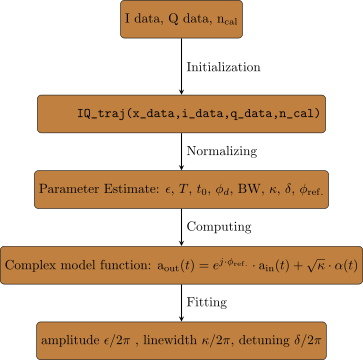
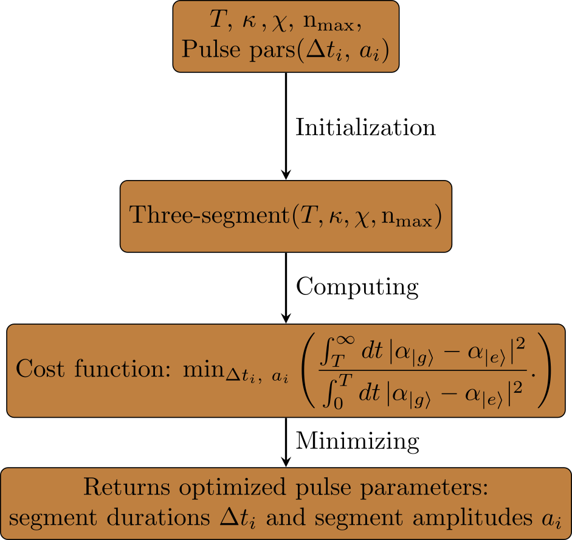

# Introduction
These classes are written for the master's thesis project "Pulse Shaping for optimal superconducting qubit readout", Philipp Thamm at Karlsruhe Institut for Thehnology (KIT).

As the name implies, this project is embedded in the research field of quantum computing and deals with a physics motivated engeneering task.
Without going furhter into the details for readers with less physical background, a brief motiviation will be outlined:

Measuring a qubit state is not as simple as for a classical measurement, since it is a quantum state.
A way to measure the qubit state is realized by coupling the system to an quantum-mechanical LC oscillator.
The resonance fequency of the resonator becomes dependent on the qubit state.
This allows to distinguish the qubit state by sending a readout microwave signal
with a moderate amplitude at frequency between the two qubit state-dependent
resonance frequencies $\omega_{rf}$ and to the resonator
and measuring the reflected signal.


Before starting with pulse shaping, it is essential to know the sepcifc parameters of the experimental setup for qubit readout.
A square pulse readout analysis class was written for parameter extraction of time domain readout signals that is as a prerequesit for pulse shaping.

Square pulse for superconducting qubit readout comes at cost of a rather slow decay of the readout signal after the information about the qubit state is obtained.
For a more optimized readout a method of adding square pulses was used. This method aims for a signal suppression after the state of the qubit has already been obtained.


## Working principles of the classes


### Square pulse analysis class
This class uses the input output relations to analyse the readout signal, if a square pulse is used. Thereby, the relevant experimental parameters can be estimated.
The intra-cavity parameters such as the linewidth $\kappa$ and the dispersive shift $\chi$ can be experimentally obtained by the state-dependent resonator phase response. Similarly, these parameters can be found by analyzing the readout signal of a square pulse.
Parameter extraction is performed using a square pulse analysis class. 
The square pulse analysis class  is initialized by passing the time array, the I data, Q data and the photon calibration from an ac stark measurement:

IQ_traj(x_data,i_data,q_data,n_cal) 

The class normalizes the amplitude of both quadratures by the maximum of the absolute amplitude of the signal.
With the help of a function method, makes a rough estimate of readout parameters:
#### Usage
----------
##### Importing the class
-------------------------
```python
from ANAlysis_class_ro import RO_class_5
from ANAlysis_class_ro.RO_class_5 import IQ_traj
```
##### Intitialising the class
```python
IQ_traj(x_data,i_data,q_data,n_cal)
```
##### Documentation
```python
#For documentation use help()
help(IQ_traj)
```
    
Parameters       
----------
x: np.ndarray
    time data (ns)
i: np.ndarray
    I-data

q: np.ndarray
    Q-data

n_cal: float
    photon number calibration factor 

Attributes
----------
a_out: np.ndarray, dtype=complex 
    normalized complex output field
    
a_in: np.ndarraydtype=complex     
    normalized complex input field
    
alpha: np.ndarray, dtype=complex   
    complex intra-cavity field
    
pars: np.ndarray, dtype=float  
    (amplitde_drive,duration,time delay,phase_drive,_,kappa,detuning_resonator,_,_,_,phase_reference)
    
ro_pars: np.ndarray, dtype = float 
    fitted pars   
    (amplitde_drive,duration,time delay,phase_drive,_,kappa,detuning_resonator,_,_,_,phase_reference)
    
ro_dict: (parameter name and fitted paramtere value 


Methods       
-------  
fid_out(self)
    Fitting the output field to the intra-cavity field model
    
Returns
-------
popt: np.ndarray()
        optimized parameters
        
pcov: (np.ndarray, np.ndarray)
        covariance matrix of the optimized parameters


    plot(self)
    1. Displays the drive amplitude, the decay rate kappa, and the detuning in MHz
     2. Plots the real and imaginary normalized measured readout data and the fitted output field to 
        the intra-cavity field model over time
     3. Parametric plot of the noramlized data and model
    
    Returns
    -------
    popt, pcov: np.ndarray(), (np.ndarray, np.ndarray)
                fit result parameters and the covariance matrix


plot_t_domain(self)
    1. Plots the normalized drive field over time
    2. Plots the real and imaginary part of the intra-cavity field over time  
    3. Plots the real and imaginary normalized measured readout data and the fitted output field to 
        the intra-cavity field model over time  


<p align="center">
  
</p>
Applying this analysis class to both qubit state-dependent readput signal, the difference in detuning gives the frequency shift between the two responses of the resonator which is linked to the coupling to the qubit.

#### Three-Segment Optimization Class
The optimization class uses the readout duration $T$, the resonator linewidth $\kappa$, the dispersive shift $\chi$, the maximum mean photon number $\rm n_{\mathrm{max}}$ and the  initial Three-segment pulse parameters ($\Delta t_{i} \, a_{i}$) for initialization and execution of the class.

Inside the class, from the initial only the free pulse parameters are passed to the python module <bf>scipy.optimize.minimize()</bf>

Using the integrated sate separation ratio as a cost function, the optimal pulse parameters are returned:

<p align="center">
  
</p>

```python
import opt_three_segment_final
from opt_three_segment_final import three_seg
three_seg(T,kappa,chi,n_max,three_seg_pulse_pars)
# for documentation use help()
help(opt_three_segment_final.four_seg)
```
